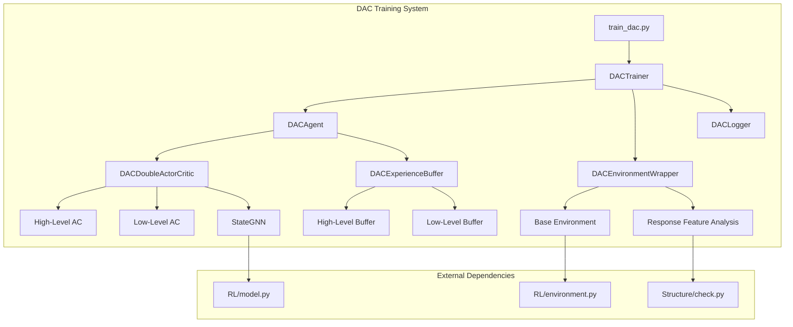
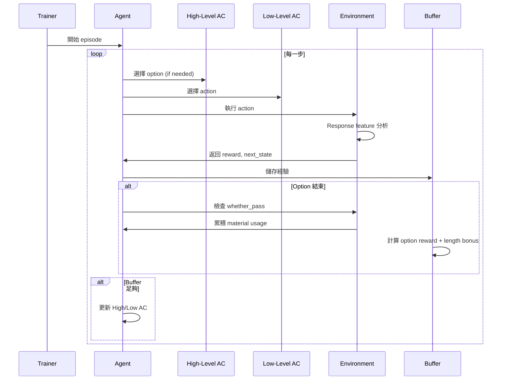

# DAC (Double Actor-Critic) 產品需求文件 (PRD)

## 文件資訊
- **專案名稱**: DAC for Structural Design Optimization
- **版本**: v1.0
- **建立日期**: 2025-01-19
- **負責人**: Kyle
- **狀態**: 待實現

---

## 1. 專案概述

### 1.1 專案背景
基於現有的 Option-Critic 結構設計優化系統，實現符合 NeurIPS 2019 論文《DAC: The Double Actor-Critic Architecture for Learning Options》的雙 Actor-Critic 架構，以提升分層強化學習在結構設計任務中的性能。

### 1.2 專案目標
- **主要目標**: 實現完全符合 DAC 論文的雙 MDP 架構
- **技術目標**: 整合 response feature 分析和 option-level 檢核機制
- **業務目標**: 提升結構材料使用效率和設計品質
- **維護目標**: 保持與現有 Option-Critic 系統的完全獨立性

### 1.3 成功指標
- [ ] DAC 訓練收斂速度 >= Option-Critic
- [ ] 最終結構材料節省率提升 >= 5%
- [ ] Option 利用分佈更均勻且有意義
- [ ] 系統模組化程度達到 100% 獨立性

---

## 2. 需求分析

### 2.1 功能需求

#### 2.1.1 核心功能需求

| 需求 ID | 功能描述 | 優先級 | 驗收標準 |
|---------|----------|--------|----------|
| FR-001 | 雙 Actor-Critic 網路架構 | P0 | 實現 High-level 和 Low-level 分離的 AC 網路 |
| FR-002 | 雙 MDP 狀態空間處理 | P0 | High-MDP 使用 global state，Low-MDP 使用 story-level state |
| FR-003 | Response Feature 整合 | P1 | 每步執行結構分析並更新 GNN features |
| FR-004 | Option-level 檢核機制 | P1 | 只在 option 結束時檢查 whether_pass |
| FR-005 | Option Length Bonus | P1 | 線性增長的 option 長度獎勵機制 |
| FR-006 | 專用經驗回放緩衝區 | P0 | 分別處理 High/Low level 經驗 |

#### 2.1.2 擴展功能需求

| 需求 ID | 功能描述 | 優先級 | 驗收標準 |
|---------|----------|--------|----------|
| FR-007 | 訓練過程可視化 | P2 | 提供 option 使用分佈、loss 曲線等圖表 |
| FR-008 | 模型檢查點管理 | P2 | 自動保存最佳模型和訓練狀態 |
| FR-009 | 推理模式支援 | P2 | 支援載入訓練好的模型進行推理 |
| FR-010 | 超參數配置管理 | P2 | 靈活的配置文件系統 |

### 2.2 非功能需求

#### 2.2.1 性能需求
- **訓練效率**: 單個 episode 訓練時間 <= Option-Critic 的 120%
- **記憶體使用**: 峰值記憶體使用 <= 16GB
- **收斂速度**: 達到穩定性能的 episode 數 <= 1000

#### 2.2.2 可靠性需求
- **系統穩定性**: 連續訓練 24 小時無崩潰
- **數值穩定性**: Loss 值保持在合理範圍，無 NaN 或爆炸
- **重現性**: 相同 seed 下結果可重現

#### 2.2.3 可維護性需求
- **模組化**: 每個功能模組獨立，耦合度 < 20%
- **代碼覆蓋率**: 核心模組測試覆蓋率 >= 80%
- **文檔完整性**: 所有公共接口都有完整的 docstring

#### 2.2.4 兼容性需求
- **版本兼容**: 支援 Python 3.8+, PyTorch 1.9+
- **系統兼容**: 支援 Linux/Windows，支援 CPU/GPU
- **向後兼容**: 不影響現有 Option-Critic 系統運行

---

## 3. 技術架構

### 3.1 系統架構圖



### 3.2 模組設計

#### 3.2.1 核心模組

| 模組名稱 | 檔案路徑 | 主要職責 | 依賴關係 |
|----------|----------|----------|----------|
| DACDoubleActorCritic | `RL/dac/dac_gnn.py` | 雙 Actor-Critic 網路實現 | StateGNN |
| DACAgent | `RL/dac/dac_agent.py` | Agent 邏輯和訓練協調 | DACDoubleActorCritic, DACExperienceBuffer |
| DACExperienceBuffer | `RL/dac/dac_buffer.py` | 雙層經驗回放緩衝區 | - |
| DACEnvironmentWrapper | `RL/dac/dac_environment.py` | 環境包裝和 response feature 整合 | Environment, check.py |
| DACTrainer | `RL/dac/dac_trainer.py` | 主訓練循環 | 所有 DAC 模組 |

#### 3.2.2 輔助模組

| 模組名稱 | 檔案路徑 | 主要職責 | 依賴關係 |
|----------|----------|----------|----------|
| DACConfig | `RL/dac/dac_config.py` | 配置管理 | - |
| DACLogger | `RL/dac/dac_logger.py` | 日誌和可視化 | - |
| DACUtils | `RL/dac/dac_utils.py` | 工具函數 | - |

### 3.3 數據流設計



---

## 4. 詳細設計規格

### 4.1 核心類別設計

#### 4.1.1 DACDoubleActorCritic

```python
class DACDoubleActorCritic(nn.Module):
    """
    DAC 雙 Actor-Critic 網路架構
    實現 High-level (option selection) 和 Low-level (action selection) 分離
    """

    def __init__(self,
                 node_feature_dim: int,
                 edge_feature_dim: int,
                 hidden_dim: int,
                 member_state_dim: int,
                 num_layers: int,
                 num_actions: int,
                 num_options: int,
                 device: str = 'cpu'):
        """
        初始化雙 Actor-Critic 網路

        Args:
            node_feature_dim: 節點特徵維度
            edge_feature_dim: 邊特徵維度
            hidden_dim: 隱藏層維度
            member_state_dim: 構件狀態維度
            num_layers: GNN 層數
            num_actions: 動作空間大小
            num_options: Option 數量
            device: 計算設備
        """
```

**主要方法**:
- `get_features(graph_data) -> (story_features, global_features)`
- `select_option(global_state, current_option=None) -> (option, log_prob)`
- `select_action(story_features, option, valid_mask=None) -> (action, log_prob)`
- `get_high_value(global_state) -> value`
- `get_low_value(story_state, option) -> value`
- `get_termination_prob(global_state, option) -> prob`

#### 4.1.2 DACExperienceBuffer

```python
class DACExperienceBuffer:
    """
    DAC 專用經驗回放緩衝區
    分別處理 High-level 和 Low-level 的經驗
    """

    def __init__(self,
                 buffer_size: int,
                 batch_size: int,
                 length_bonus_weight: float = 0.1):
        """
        初始化經驗緩衝區

        Args:
            buffer_size: 緩衝區大小
            batch_size: 批次大小
            length_bonus_weight: Option 長度獎勵權重
        """
```

**資料結構**:
```python
@dataclass
class HighLevelExperience:
    global_state: torch.Tensor
    option: int
    option_reward: float  # 包含 length bonus
    next_global_state: torch.Tensor
    done: bool

@dataclass
class LowLevelExperience:
    story_state: torch.Tensor
    option: int
    action: int
    reward: float
    next_story_state: torch.Tensor
    done: bool
```

#### 4.1.3 DACEnvironmentWrapper

```python
class DACEnvironmentWrapper:
    """
    DAC 環境包裝器
    整合 response feature 計算和 option-level 檢核
    """

    def __init__(self,
                 base_env: Environment,
                 response_feature: bool = True,
                 length_bonus_weight: float = 0.1):
        """
        初始化環境包裝器

        Args:
            base_env: 基礎環境
            response_feature: 是否啟用 response feature
            length_bonus_weight: Option 長度獎勵權重
        """
```

### 4.2 演算法流程

#### 4.2.1 訓練流程

```python
def train_episode():
    """單個 episode 的訓練流程"""

    # 1. 初始化
    structure = env.reset()
    current_option = None
    option_step_count = 0
    episode_reward = 0

    while not done:
        # 2. 特徵提取
        story_features, global_features = agent.get_features(structure)

        # 3. Option 選擇 (High-level)
        if current_option is None or should_terminate_option():
            option, option_log_prob = agent.select_option(global_features)
            current_option = option
            option_step_count = 0

        # 4. Action 選擇 (Low-level)
        action, action_log_prob = agent.select_action(
            story_features, current_option, valid_actions_mask
        )

        # 5. 環境互動
        next_structure, reward, done, fail_name, fail_reason = env.step(
            structure, action, option_terminated=(option != current_option)
        )

        # 6. 經驗儲存
        agent.store_experience(
            global_features, story_features,
            current_option, action, reward,
            next_global_features, next_story_features,
            done, option_terminated
        )

        # 7. 模型更新
        if agent.should_update():
            losses = agent.update()
            logger.log_losses(losses)

        # 8. 狀態更新
        structure = next_structure
        option_step_count += 1
        episode_reward += reward

    return episode_reward
```

#### 4.2.2 Loss Functions

**High-level Actor-Critic Loss**:
```python
def compute_high_level_loss(batch):
    """計算 High-level Actor-Critic Loss"""

    # Critic Loss (TD Error)
    values = model.get_high_value(batch.states)
    next_values = target_model.get_high_value(batch.next_states)
    targets = batch.rewards + gamma * next_values * (1 - batch.dones)
    critic_loss = F.mse_loss(values, targets)

    # Actor Loss (Policy Gradient)
    advantages = (targets - values).detach()
    option_log_probs = model.get_option_log_probs(batch.states, batch.options)
    actor_loss = -(option_log_probs * advantages).mean()

    # Termination Loss
    term_loss = compute_termination_loss(batch)

    return actor_loss + critic_loss + term_loss
```

**Low-level Actor-Critic Loss**:
```python
def compute_low_level_loss(batch):
    """計算 Low-level Actor-Critic Loss"""

    # Critic Loss
    values = model.get_low_value(batch.states, batch.options)
    next_values = target_model.get_low_value(batch.next_states, batch.options)
    targets = batch.rewards + gamma * next_values * (1 - batch.dones)
    critic_loss = F.mse_loss(values, targets)

    # Actor Loss
    advantages = (targets - values).detach()
    action_log_probs = model.get_action_log_probs(
        batch.states, batch.options, batch.actions
    )
    actor_loss = -(action_log_probs * advantages).mean()

    return actor_loss + critic_loss
```

---

## 5. 實現計劃

### 5.1 開發階段

#### Phase 1: 核心架構 (Week 1-2)
**目標**: 建立 DAC 基礎架構

**交付物**:
- [ ] `DACDoubleActorCritic` 網路實現
- [ ] `DACExperienceBuffer` 基礎功能
- [ ] `DACAgent` 框架
- [ ] 基礎單元測試

**驗收標準**:
- [ ] 網路可以成功前向傳播
- [ ] Buffer 可以正確儲存和採樣經驗
- [ ] Agent 可以執行基本的 act 和 update

**風險與緩解**:
- **風險**: StateGNN 特徵維度不匹配
- **緩解**: 先用簡單的 MLP 替代，確保整體架構正確

#### Phase 2: 環境整合 (Week 3-4)
**目標**: 整合 response feature 和檢核機制

**交付物**:
- [ ] `DACEnvironmentWrapper` 完整實現
- [ ] Response feature 整合測試
- [ ] Option-level 檢核邏輯
- [ ] 環境互動測試

**驗收標準**:
- [ ] 每步可以正確計算 response features
- [ ] Option 結束時檢核邏輯正確
- [ ] Material usage 累積計算準確

**風險與緩解**:
- **風險**: Response feature 計算時間過長
- **緩解**: 實現非同步計算或簡化版本

#### Phase 3: 訓練優化 (Week 5-6)
**目標**: 完整的訓練流程和優化

**交付物**:
- [ ] `DACTrainer` 完整實現
- [ ] Loss functions 實現和調試
- [ ] 超參數調優
- [ ] 訓練穩定性測試

**驗收標準**:
- [ ] 訓練過程收斂且穩定
- [ ] Loss 值在合理範圍內
- [ ] 至少一個簡單案例訓練成功

**風險與緩解**:
- **風險**: 訓練不穩定或不收斂
- **緩解**: 實現漸進式學習率、gradient clipping

#### Phase 4: 驗證與優化 (Week 7-8)
**目標**: 性能驗證和系統優化

**交付物**:
- [ ] DAC vs Option-Critic 對比實驗
- [ ] 性能報告和分析
- [ ] 代碼優化和重構
- [ ] 完整文檔

**驗收標準**:
- [ ] DAC 性能 >= Option-Critic baseline
- [ ] 系統通過所有測試用例
- [ ] 文檔完整且準確

### 5.2 里程碑時程

| 里程碑 | 完成日期 | 關鍵成果 | 風險等級 |
|--------|----------|----------|----------|
| M1: 核心架構完成 | Week 2 | 基礎網路和 Buffer 實現 | 中 |
| M2: 環境整合完成 | Week 4 | Response feature 和檢核整合 | 高 |
| M3: 訓練流程完成 | Week 6 | 完整的端到端訓練 | 高 |
| M4: 驗證完成 | Week 8 | 性能驗證和最終交付 | 中 |

### 5.3 品質保證計劃

#### 5.3.1 測試策略
- **單元測試**: 覆蓋所有核心模組，目標覆蓋率 80%
- **整合測試**: 測試模組間接口和數據流
- **性能測試**: 記憶體使用、訓練速度基準測試
- **回歸測試**: 確保不影響現有 Option-Critic 系統

#### 5.3.2 代碼審查
- **架構審查**: 確保符合 DAC 論文設計
- **性能審查**: 識別性能瓶頸
- **安全審查**: 檢查數值穩定性和邊界條件

---

## 6. 風險管理

### 6.1 技術風險

| 風險 | 概率 | 影響 | 緩解策略 |
|------|------|------|----------|
| StateGNN 特徵不匹配 | 中 | 高 | 預先測試特徵維度，準備 fallback 方案 |
| 訓練不收斂 | 高 | 高 | 實現多種正規化技術，參考 baseline 超參數 |
| 記憶體不足 | 中 | 中 | 實現 batch 分割，優化數據結構 |
| Response feature 計算緩慢 | 中 | 中 | 實現快取機制，考慮近似計算 |

### 6.2 專案風險

| 風險 | 概率 | 影響 | 緩解策略 |
|------|------|------|----------|
| 開發時程延遲 | 中 | 中 | 分階段交付，關鍵功能優先 |
| 需求變更 | 低 | 中 | 模組化設計，預留擴展接口 |
| 人力資源不足 | 低 | 高 | 完善文檔，降低學習成本 |

---

## 7. 資源需求

### 7.1 硬體需求
- **最低配置**: 16GB RAM, GTX 1080 或同等 GPU
- **推薦配置**: 32GB RAM, RTX 3080 或同等 GPU
- **儲存需求**: 50GB 可用空間（數據、模型、日誌）

### 7.2 軟體需求
- **作業系統**: Linux (推薦) 或 Windows 10+
- **Python**: 3.8+
- **深度學習框架**: PyTorch 1.9+, PyTorch Geometric
- **其他依賴**: NumPy, Matplotlib, Tensorboard

### 7.3 人力需求
- **主要開發者**: 1人，全職 8 週
- **技術支援**: 現有 Option-Critic 系統開發者
- **測試**: 1人，兼職 2 週

---

## 8. 成功標準與驗收

### 8.1 功能驗收標準

| 功能模組 | 驗收標準 | 測試方法 |
|----------|----------|----------|
| 雙 Actor-Critic 網路 | 正確實現 High/Low level 分離 | 單元測試 + 人工檢查 |
| 經驗回放緩衝區 | 正確處理雙層經驗儲存 | 單元測試 + 數據驗證 |
| 環境包裝器 | Response feature 正確整合 | 整合測試 + 輸出驗證 |
| 訓練流程 | 端到端訓練成功 | 完整訓練測試 |

### 8.2 性能驗收標準

| 指標 | 目標值 | 測量方法 |
|------|--------|----------|
| 訓練收斂速度 | <= 1000 episodes | 監控 episode reward 穩定性 |
| 最終性能 | >= Option-Critic baseline | 同一環境下對比實驗 |
| 記憶體使用 | <= 16GB | 監控訓練過程峰值記憶體 |
| 訓練速度 | <= Option-Critic 的 120% | 計時對比 |

### 8.3 品質驗收標準

| 品質屬性 | 標準 | 驗證方法 |
|----------|------|----------|
| 代碼覆蓋率 | >= 80% | 自動化測試報告 |
| 文檔完整性 | 100% 公共接口有文檔 | 文檔審查 |
| 模組獨立性 | 與 Option-Critic 零耦合 | 靜態分析 + 部署測試 |
| 數值穩定性 | 無 NaN/Inf，loss 在合理範圍 | 長時間訓練測試 |

---

## 9. 交付清單

### 9.1 代碼交付物
- [ ] `RL/dac/` 完整模組包
- [ ] `train_dac.py` 主訓練腳本
- [ ] `inference_dac.py` 推理腳本
- [ ] 配置文件範例
- [ ] 單元測試套件

### 9.2 文檔交付物
- [ ] API 文檔（自動生成）
- [ ] 使用手冊
- [ ] 實驗報告
- [ ] 架構設計文檔
- [ ] 故障排除指南

### 9.3 實驗結果
- [ ] DAC vs Option-Critic 性能對比報告
- [ ] Response feature 消融實驗結果
- [ ] Option length bonus 調優結果
- [ ] 訓練過程可視化圖表

---

## 10. 附錄

### 10.1 技術參考
- [DAC 原論文](https://arxiv.org/abs/1904.12691)
- [Option-Critic 論文](https://arxiv.org/abs/1609.05140)
- [PyTorch 官方文檔](https://pytorch.org/docs/)

### 10.2 約定與假設
- 假設現有 StateGNN 和 Environment 模組穩定可用
- 假設有足夠的計算資源進行訓練和測試
- 採用 Git flow 分支管理策略
- 代碼風格遵循 PEP 8 標準

### 10.3 版本歷史
| 版本 | 日期 | 變更內容 | 作者 |
|------|------|----------|------|
| v1.0 | 2025-01-19 | 初始版本 | Kyle |

---

**文件結束**