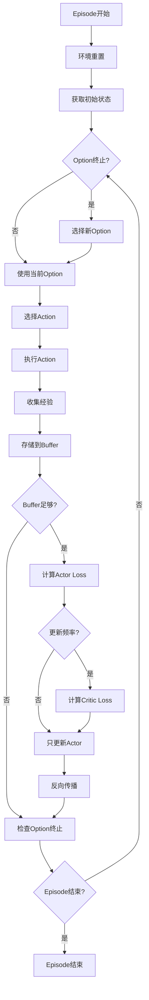
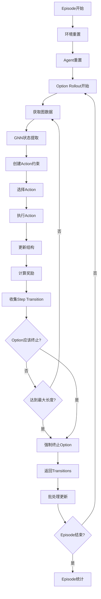

# Option-Critic 训练流程对比分析

本文档详细分析并对比了两个Option-Critic实现的训练流程差异：
- **option-critic-pytorch**: 标准的Option-Critic实现
- **GraphRL_story_level**: 基于图神经网络的结构化设计应用

## 目录
1. [概述](#概述)
2. [Option-Critic-PyTorch训练流程](#option-critic-pytorch训练流程)
3. [GraphRL_story_level训练流程](#graphrl_story_level训练流程)
4. [关键差异分析](#关键差异分析)
5. [代码示例对比](#代码示例对比)
6. [性能与复杂度分析](#性能与复杂度分析)
7. [总结与建议](#总结与建议)

## 概述

两个实现都基于Option-Critic算法，但在训练流程上存在显著差异：

| 特性 | Option-Critic-PyTorch | GraphRL_story_level |
|------|----------------------|-------------------|
| **训练循环** | 简单episode-step循环 | 复杂hierarchical rollout |
| **更新方式** | 每步直接更新 | Option-level + Step-level更新 |
| **经验收集** | 标准转移 | 图结构转移 |
| **状态处理** | 直接观察 | GNN特征提取 |

## Option-Critic-PyTorch训练流程

### 整体结构

```python
# main.py: 第72-142行
while steps < args.max_steps_total:
    # Episode初始化
    obs = env.reset()
    state = option_critic.get_state(to_tensor(obs))
    current_option = 0
    
    while not done and ep_steps < args.max_steps_ep:
        # 1. Option选择 (epsilon-greedy)
        if option_termination:
            current_option = (np.random.choice(args.num_options) 
                            if np.random.rand() < epsilon 
                            else greedy_option)
        
        # 2. Action选择 (intra-option policy)
        action, logp, entropy = option_critic.get_action(state, current_option)
        
        # 3. 环境交互
        next_obs, reward, done, _ = env.step(action)
        
        # 4. 经验存储
        buffer.push(obs, current_option, reward, next_obs, done)
        
        # 5. 网络更新 (每步更新)
        if len(buffer) > args.batch_size:
            # Actor loss (step-level)
            actor_loss = actor_loss_fn(obs, current_option, logp, entropy, 
                                     reward, done, next_obs, 
                                     option_critic, option_critic_prime, args)
            
            # Critic loss (batch-level, 每4步)
            if steps % args.update_frequency == 0:
                data_batch = buffer.sample(args.batch_size)
                critic_loss = critic_loss_fn(option_critic, option_critic_prime, 
                                           data_batch, args)
            
            # 反向传播
            optim.zero_grad()
            loss.backward()
            optim.step()
        
        # 6. Option终止检查
        option_termination, greedy_option = option_critic.predict_option_termination(
            next_state, current_option)
```

### 训练流程图



### 关键特点

1. **简单直接**: 每个时间步骤处理一个action
2. **立即更新**: Actor在每步更新，Critic按频率更新
3. **标准经验**: 存储(s,o,r,s',done)转移
4. **同步处理**: 单线程顺序执行

## GraphRL_story_level训练流程

### 整体结构

GraphRL版本使用了更复杂的hierarchical训练流程：

```python
# train_option_critic.py: 第1986行开始
for episode in range(args.num_episodes):
    # Episode级别处理
    episode_info = train_episode(env, agent)
    
def train_episode(env, agent):
    obs = env.reset()
    agent.reset_episode()
    
    while not done:
        # 1. Agent决策 (Option + Action)
        action, option_terminated = agent.act(obs, valid_actions)
        
        # 2. 环境交互
        next_obs, reward, done, info = env.step(action, option_terminated)
        
        # 3. Agent观察 (包含复杂的更新逻辑)
        agent.observe(obs, action, reward, next_obs, done, option_terminated, info)
```

### Hierarchical Rollout机制

```python
# train_option_critic.py: 第216行 rollout_option函数
def rollout_option(structure, base_env, device, max_option_len, 
                   current_option, oc_model, epsilon=None):
    """
    执行一个完整的option，返回step-level transitions
    """
    step_transitions = []
    
    # Option内部循环
    while length < max_option_len:
        # 1. 状态处理 (GNN)
        graph_data = get_graph_data(structure, device)
        state = oc_model.get_state(*graph_data)
        
        # 2. Action选择 (带约束)
        valid_mask = create_valid_actions_mask(structure, device)
        action, logp, entropy = oc_model.get_action(state, current_option, valid_mask)
        
        # 3. 环境交互
        structure_updated = apply_primitive_action(structure, action, base_env)
        reward = calculate_reward(structure_updated, structure)
        
        # 4. 收集step-level transition
        step_transitions.append({
            'obs': graph_data,
            'action': action,
            'logp': logp,
            'entropy': entropy,
            'reward': reward,
            'done': episode_done,
            'next_obs': next_graph_data,
            'option': current_option
        })
        
        # 5. Option终止检查
        if should_terminate_option(state, current_option, oc_model):
            break
    
    return structure_updated, step_transitions, stats
```

### 训练流程图



### 复杂状态处理

```python
# option_critic_gnn.py: 第131-182行
def get_state(self, graph_x, graph_edge_index, graph_edge_attr, story_batch):
    """
    通过StateGNN处理图结构数据
    """
    # 1. 设备转换
    graph_x = ensure_tensor_on_device(graph_x, self.device)
    graph_edge_index = ensure_tensor_on_device(graph_edge_index, self.device)
    
    # 2. GNN特征提取
    gnn_features = self.state_gnn(
        x=graph_x,
        edge_index=graph_edge_index, 
        edge_attr=graph_edge_attr,
        story_batch=story_batch
    )
    
    # 3. 全局池化 (多个story members -> 单一状态)
    if gnn_features.dim() == 2 and gnn_features.shape[0] > 1:
        state = gnn_features.mean(dim=0, keepdim=True)
    
    return state
```

### 关键特点

1. **Hierarchical结构**: Option-level和Step-level分离处理
2. **批量rollout**: 一次执行完整option再批量更新
3. **图结构处理**: 复杂的GNN状态提取和约束处理
4. **异步更新**: 先收集经验，后批量更新

## 关键差异分析

### 1. 训练循环结构

| 维度 | Option-Critic-PyTorch | GraphRL_story_level |
|------|----------------------|-------------------|
| **循环层次** | Episode → Step | Episode → Option → Step |
| **更新时机** | 每步即时更新 | Option完成后批量更新 |
| **状态管理** | 简单观察转换 | 复杂图结构处理 |
| **并行程度** | 单线程顺序 | 潜在批处理优化 |

### 2. 经验收集方式

**Option-Critic-PyTorch:**
```python
# 简单的SARS转移
buffer.push(obs, current_option, reward, next_obs, done)
```

**GraphRL_story_level:**
```python
# 复杂的step-level transitions
step_transitions.append({
    'obs': (graph_x, graph_edge_index, graph_edge_attr, story_batch),
    'action': action,
    'logp': logp,
    'entropy': entropy, 
    'reward': reward,
    'done': episode_done,
    'next_obs': next_graph_data,
    'option': current_option
})
```

### 3. 更新策略

**Option-Critic-PyTorch:**
- **Actor**: 每步更新 (step-level)
- **Critic**: 每4步批量更新 (batch-level)
- **网络同步**: 每200步同步target网络

**GraphRL_story_level:**
- **经验收集**: Option完成后收集所有step transitions
- **批量更新**: 使用收集的transitions批量计算loss
- **复杂loss**: 处理图结构的复杂维度匹配

### 4. 计算复杂度

| 组件 | Option-Critic-PyTorch | GraphRL_story_level |
|------|----------------------|-------------------|
| **状态处理** | O(1) 简单转换 | O(N×E) GNN计算 |
| **Action选择** | O(A) softmax | O(A) + 约束处理 |
| **Loss计算** | O(B) 批处理 | O(B×G) 图批处理 |
| **内存使用** | 低 | 高 (图结构) |

## 代码示例对比

### 关键函数对比

**1. 状态获取**

```python
# Option-Critic-PyTorch (简单)
def get_state(self, obs):
    if obs.ndim < 4:
        obs = obs.unsqueeze(0)
    obs = obs.to(self.device)
    state = self.features(obs)  # CNN/MLP处理
    return state

# GraphRL_story_level (复杂)
def get_state(self, graph_x, graph_edge_index, graph_edge_attr, story_batch):
    # 设备转换
    graph_x = ensure_tensor_on_device(graph_x, self.device)
    graph_edge_index = ensure_tensor_on_device(graph_edge_index, self.device)
    
    # GNN处理
    gnn_features = self.state_gnn(
        x=graph_x, edge_index=graph_edge_index,
        edge_attr=graph_edge_attr, story_batch=story_batch
    )
    
    # 全局池化
    if gnn_features.dim() == 2 and gnn_features.shape[0] > 1:
        state = gnn_features.mean(dim=0, keepdim=True)
    
    return state
```

**2. Action选择**

```python
# Option-Critic-PyTorch (标准)
def get_action(self, state, option):
    logits = state.data @ self.options_W[option] + self.options_b[option]
    action_dist = (logits / self.temperature).softmax(dim=-1)
    action_dist = Categorical(action_dist)
    action = action_dist.sample()
    return action.item(), action_dist.log_prob(action), action_dist.entropy()

# GraphRL_story_level (带约束)
def get_action(self, state, option, valid_actions_mask=None):
    # 处理批维度
    if state.dim() == 2 and state.shape[0] > 1:
        state_for_action = state.mean(dim=0)
    
    # 计算logits
    logits = state_for_action @ self.options_W[option] + self.options_b[option]
    
    # 应用action masking
    if valid_actions_mask is not None:
        logits[~valid_actions_mask] = -1e8
    
    # softmax和采样
    action_dist = (logits / self.temperature).softmax(dim=-1)
    action_dist = Categorical(action_dist)
    
    if self.testing:
        action = torch.argmax(action_dist.probs, dim=-1)  # 测试时确定性
    else:
        action = action_dist.sample()  # 训练时随机
        
    return action.item(), action_dist.log_prob(action), action_dist.entropy()
```

## 性能与复杂度分析

### 计算开销

| 操作 | Option-Critic-PyTorch | GraphRL_story_level | 倍数差异 |
|------|----------------------|-------------------|---------|
| **状态提取** | ~1ms (CNN) | ~5-10ms (GNN) | 5-10x |
| **Action选择** | ~0.1ms | ~0.5ms (约束) | 5x |
| **Loss计算** | ~2ms | ~10-20ms (图) | 5-10x |
| **总体** | 快速 | 较慢但更强大 | 5-10x |

### 内存使用

```python
# Option-Critic-PyTorch: 简单
- 观察: (batch_size, obs_dim)
- 状态: (batch_size, hidden_dim)  
- 总内存: O(B × D)

# GraphRL_story_level: 复杂
- 图节点: (total_nodes, node_features)
- 图边: (total_edges, edge_features)
- 批处理: 复杂的不规则结构
- 总内存: O(N × E × F)
```

### 可扩展性

| 特性 | Option-Critic-PyTorch | GraphRL_story_level |
|------|----------------------|-------------------|
| **环境适应** | 需要重写网络 | 图结构天然适应 |
| **动作空间** | 固定大小 | 动态约束处理 |
| **状态复杂度** | 限于向量/图像 | 任意图结构 |
| **领域迁移** | 困难 | 相对容易 |

## 总结与建议

### 主要差异总结

1. **架构复杂度**: GraphRL版本显著更复杂，但提供更强的表达能力
2. **计算开销**: GraphRL版本慢5-10倍，但处理复杂结构化问题
3. **实现完整性**: Option-Critic-PyTorch更完整稳定，GraphRL版本存在一些实现问题
4. **应用场景**: 前者适合标准RL问题，后者适合结构化设计问题

### 使用建议

**选择Option-Critic-PyTorch当:**
- 问题是标准的MDP
- 需要快速原型和训练
- 观察空间是向量或图像
- 资源有限

**选择GraphRL_story_level当:**
- 问题具有图结构
- 需要处理动态约束
- 状态空间复杂且结构化
- 有足够计算资源

### 改进方向

**对于GraphRL版本:**
1. 修复导入错误和实现问题
2. 优化GNN计算效率
3. 简化状态处理流程
4. 加强错误处理和日志

**对于标准版本:**
1. 增加图结构支持
2. 添加动态约束处理
3. 提供更灵活的网络架构
4. 改进可视化和分析工具

---

*本文档基于对两个实现的深入代码分析，提供了详细的技术对比。如需了解具体实现细节，请参考相应的源代码文件。*